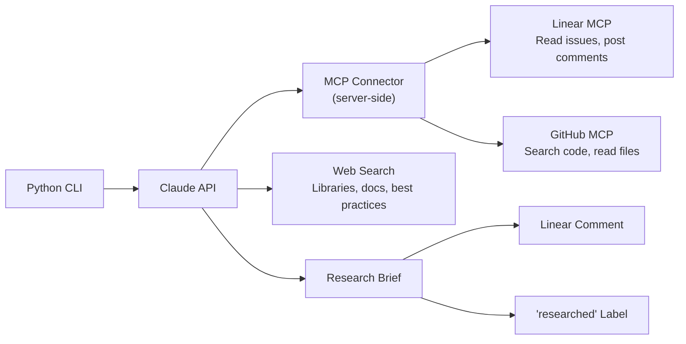

# claude-engineering-agent

An adaptive research agent that takes a Linear issue, investigates it using multiple tools, and produces a contextualised technical brief — posted back to Linear as a comment.

The agent doesn't follow a fixed script. Claude decides what to research based on the issue content, calls the right tools, evaluates intermediate results, and adapts. Findings are grounded against the repo's own skills and templates, so output is contextualised to the developer's ecosystem rather than generic advice.

**Phase 1 (complete):** Adaptive research agent — issue → research → structured brief → Linear comment.

**Phase 2 (in progress):** Full engineering pipeline — issue → research → PRD → build guide → Claude Code handoff → implementation → PR.

## Example run

```
$ uv run python -m claude_engineering_agent JAM-238

Researching JAM-238 with model claude-sonnet-4-6

============================================================
  Iteration 1/5
============================================================

  🔧 Tool: linear/get_issue
  🔧 Tool: github/get_file_contents
  🔧 Tool: linear/get_issue
  🔧 Tool: github/get_file_contents
  🔧 Tool: github/search_code

  # Research Brief: Data Acquisition & Parsing — FCA Handbook PDFs
  ...

  🔧 Tool: linear/save_comment
  🔧 Tool: linear/save_issue

────────────────────────────────────────
  Stop reason: end_turn
  Tools called: 11
  Tokens: 474,336 in / 5,090 out
  Duration: 435s
────────────────────────────────────────
```

The agent read the Linear issue, checked the parent issue for context, searched for PDF parsing libraries, compared pymupdf4llm vs pdfplumber, identified the FCA Handbook's document hierarchy, and posted a structured brief with concrete recommendations — all in a single API call via the MCP Connector.

See `docs/examples/` for full research briefs.

## Architecture



### MCP Connector — not client-side MCP

The agent uses Anthropic's **MCP Connector** (`mcp-client-2025-11-20` beta) — passing `mcp_servers=[...]` directly in the `messages.create()` call. Anthropic's infrastructure handles connection, tool discovery, and execution server-side. No MCP Python SDK, no session management, no tool wrappers.

Why this over client-side MCP:

- All MCP servers are remote and URL-accessible — no local stdio servers needed
- We only need tools, not MCP resources or prompts
- It's the pattern Anthropic recommends for production API integrations
- Eliminates an entire client layer (connection handling, tool discovery, session management)

### Streaming

The agent uses `client.beta.messages.stream()` for real-time visibility. Tool calls and reasoning appear in the terminal as Claude works — no black-box waits. Execution traces are saved as JSON to `docs/traces/`.

### Delivery

After producing the research brief, Claude posts it as a comment on the source Linear issue and adds a `researched` label — all within the same agentic loop via Linear MCP. Duplicate detection prevents re-posting on subsequent runs.

## Token optimisation

Two techniques reduced input token usage significantly:

### 1. Deferred tool loading

The MCP Connector discovers all available tools on each server. Linear has 35+ tools, GitHub has 41+ — most of which the agent never uses. Using `defer_loading` on the `mcp_toolset` configuration, we eagerly load only the tools the agent actually calls:

- **Linear:** `get_issue`, `list_comments`, `save_comment`, `save_issue`, `list_issue_labels`
- **GitHub:** `get_file_contents`, `search_code`, `search_repositories`, `pull_request_read`

### 2. Local skills inventory

The repo contains 11 skills and 9 agents in `.claude/skills/` and `.claude/agents/`. Instead of the agent discovering these via GitHub MCP calls every run, the runner reads the local filesystem at startup, extracts descriptions from YAML frontmatter, and injects the inventory into the system prompt. Claude only uses GitHub MCP to read a skill's full content when it's genuinely needed for the recommendation.

## Dogfooding results

Tested against 6 sub-issues of the FCA Regulatory RAG Eval project (JAM-237), spanning data parsing, synthetic data generation, ingestion pipelines, retrieval, evaluation frameworks, and documentation:

| Issue | Topic | Tools | Tokens In | Duration |
|-------|-------|-------|-----------|----------|
| JAM-238 | Data acquisition & parsing | 6 | 223k | 103s |
| JAM-239 | Synthetic data generation | 12 | 549k | 733s |
| JAM-240 | Ingestion pipeline | 11 | 474k | 435s |
| JAM-241 | Retrieval & generation | 8 | 378k | 423s |
| JAM-242 | Eval framework | 12 | 604k | 719s |
| JAM-243 | Documentation & publish | 18 | 368k | 1032s |

### Quality assessment (1–5)

| Dimension | Score | Notes |
|-----------|-------|-------|
| Research relevance | 4 | Targets the right questions consistently |
| Brief quality | 5 | Specific and actionable — library names, API model IDs, concrete steps |
| Skill references | 4 | Relevant when present, never forced |
| Factual accuracy | 4 | Grounded in web search, no hallucinated libraries detected |
| Differentiation | 5 | Every brief is unmistakably about its issue |

## Setup

### Prerequisites

- Python 3.12+
- [uv](https://docs.astral.sh/uv/) for package management
- Anthropic API key
- Linear and GitHub MCP OAuth tokens

### Installation

```bash
git clone https://github.com/jacarty/claude-engineering-agent.git
cd claude-engineering-agent
uv sync
cp .env.example .env
# Edit .env with your API keys and tokens
```

### Environment variables

| Variable | Purpose | Source |
|----------|---------|--------|
| `ANTHROPIC_API_KEY` | Claude API access | [Anthropic Console](https://console.anthropic.com/) |
| `LINEAR_MCP_TOKEN` | Linear MCP server auth | Linear OAuth flow via [MCP Inspector](https://modelcontextprotocol.io/docs/tools/inspector) |
| `GITHUB_MCP_PAT` | GitHub MCP server auth | Uses GitHub PAT Token |

### Usage

```bash
uv run python -m claude_engineering_agent JAM-238
```

### Git hooks

```bash
uv run pre-commit install
cp .githooks/commit-msg .git/hooks/commit-msg
cp .githooks/pre-push .git/hooks/pre-push
chmod +x .git/hooks/commit-msg .git/hooks/pre-push
```

## Project structure

```
claude-engineering-agent/
├── .claude/
│   ├── agents/                  # Claude Code subagents (9 agents)
│   ├── commands/                # Claude Code custom commands
│   ├── skills/                  # Thinking and writing frameworks (11 skills)
│   └── settings.json            # Claude Code tool permissions
├── docs/
│   ├── examples/                # Example research briefs from dogfooding
│   ├── traces/                  # Execution traces (JSON)
│   └── process.md               # Development process and agent cadence
├── src/
│   └── claude_engineering_agent/
│       ├── __init__.py
│       ├── __main__.py          # CLI entry point
│       ├── config.py            # MCP server + tool configuration
│       ├── prompts.py           # System prompt (the planning engine)
│       └── runner.py            # Streaming agentic loop
├── tests/
├── pyproject.toml
├── .env.example
├── CLAUDE.md
└── README.md
```

## Future: full engineering pipeline

Phase 2 extends the agent from a research tool to a complete issue → code pipeline:

```
Linear issue
  → Research brief (phase 1 — done)
  → PRD generation (--prd)
  → Build guide generation (--build-guide)
  → Claude Code handoff (--implement)
  → PR creation (--full)
```

Each step reads the previous step's output from Linear comments, so the pipeline is stateless — any step can be run independently if the prerequisites exist. The subagent ecosystem (code-reviewer, test-generator, phase-acceptance) gates each phase of Claude Code's implementation.

## Licence

MIT
